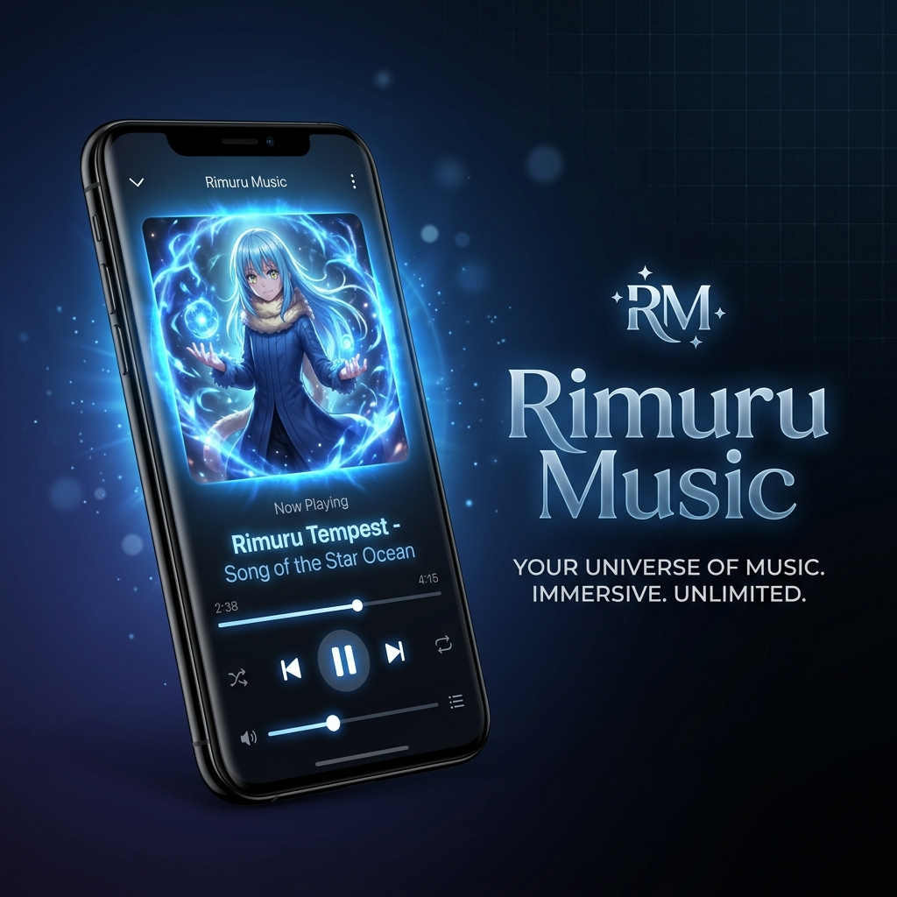
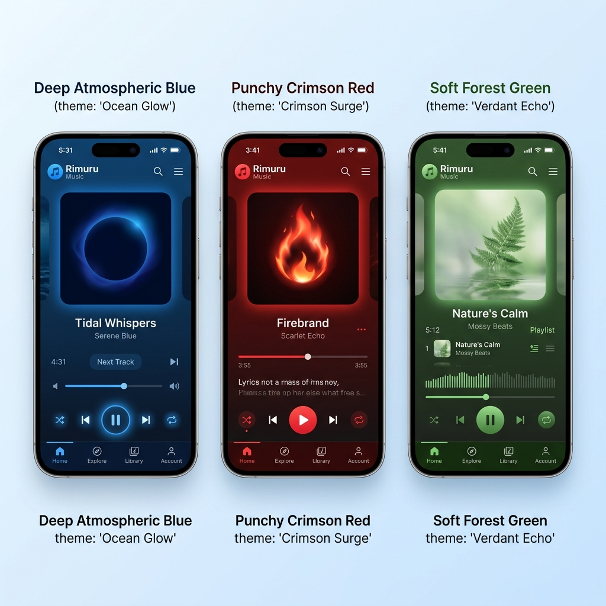

# 💎 Rimuru Music: The Elite Experience 👋

<p align="center">
  
</p>

<p align="center">
  <a href="https://github.com/Trnnt/Music_app/releases"></a>
  <a href="https://github.com/Trnnt/Music_app/releases"></a>
  <a href="LICENSE"></a>
</p>

---

## 🚀 Download & Experience

Rimuru Music is a high-performance, professionally branded mobile music player built with Expo and React Native. It combines a cinematic "Vibrant" aesthetic with powerful local and online music management.

<p align="center">
  <a href="https://github.com/Trnnt/Music_app/releases/download/v1.0.0/application-eb52a6ec-076d-45af-9518-829ff4d3de95.zip">
    
  </a>
  <a href="https://github.com/Trnnt/Music_app/releases">
    
  </a>
</p>

> [!TIP]
> **Recommended**: Download the [Official Release ZIP](https://github.com/Trnnt/Music_app/releases/download/v1.0.0/application-eb52a6ec-076d-45af-9518-829ff4d3de95.zip), extract the APK, and install it on your Android device!

---

## 🎨 Screenshots Showcase

<p align="center">
  
</p>

---

## ✨ Premium Features

### 🌈 1. Vibrant Theme Engine
- **Living UI**: The player background and accent colors adapt dynamically to the dominant tones of your current song's artwork.
- **Artwork Aura**: A luminous shadow effect that "bleeds" colors onto the screen for a cinematic feel.

### 🔄 2. Stealth Sync (Pull-to-Refresh)
- **Instant scan**: Finding newly downloaded songs (YouTube, etc.) used to require a restart. Now, just **swipe down** on your library for an instant background re-scan.

### 💎 3. Minimalist sorting
- **Sliders Icon**: Tucked away in the glassmorphic header is a sleek sorting icon. Toggle between **Title (A-Z)** and **Recently Added** with zero UI clutter.

### 🖼️ 4. HD Store-Ready Artwork
- **Integrated System**: Uses `expo-image` for high-performance caching. Automatically fetches original high-res posters from online stores.

---

## 🛠️ Get Started (Developers)

1. **Install dependencies**
   ```bash
   npm install
   ```

2. **Start the app (Local)**
   ```bash
   npx expo start
   ```

---

## 🤖 F-Droid Hosting (Roadmap)

To get Rimuru Music onto the official F-Droid store, we follow these steps:
1. **Metadata**: Prepare the `fastlane` metadata in the repo.
2. **Submission**: Open a Merge Request on the [F-Droid Data repo](https://gitlab.com/fdroid/fdroiddata).
3. **Build**: Ensure the build is fully FOSS-compliant (which we have done with our current architecture).

## 💎 Join the Rimuru Journey

Rimuru Music is designed for lovers of high-quality audio and cinematic UI. Feel free to explore the code, contribute, and enjoy the ultimate music experience! 🍹
